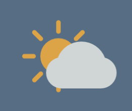
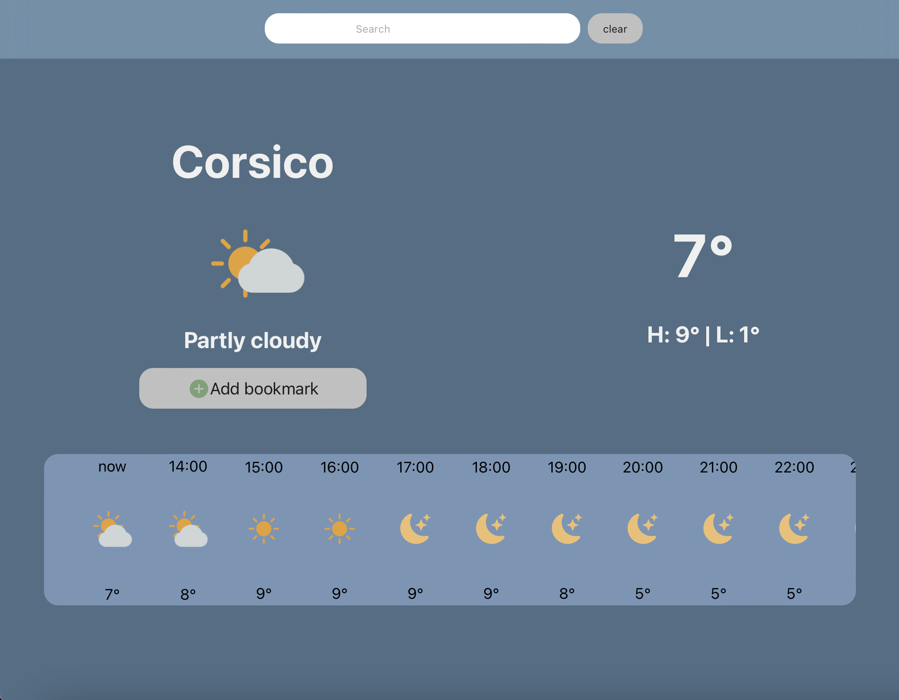
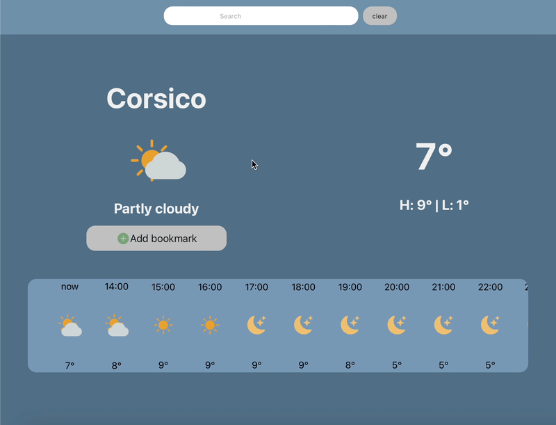
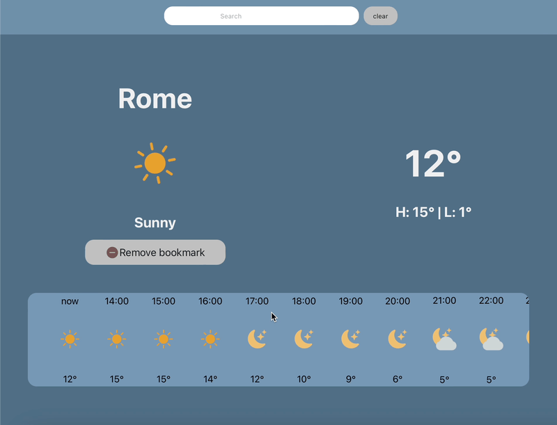
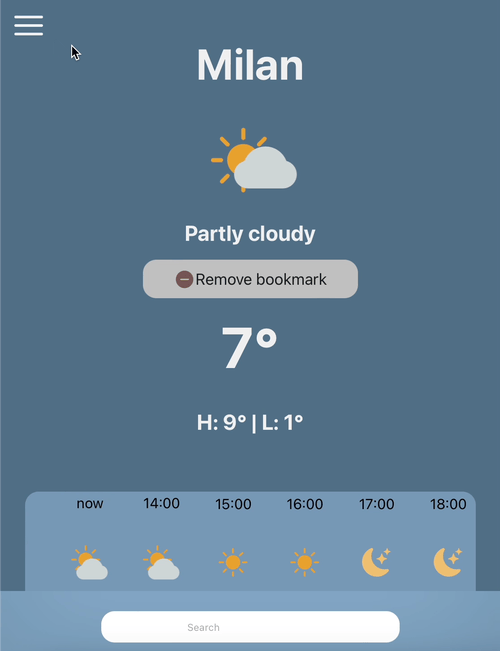
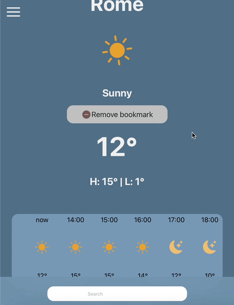
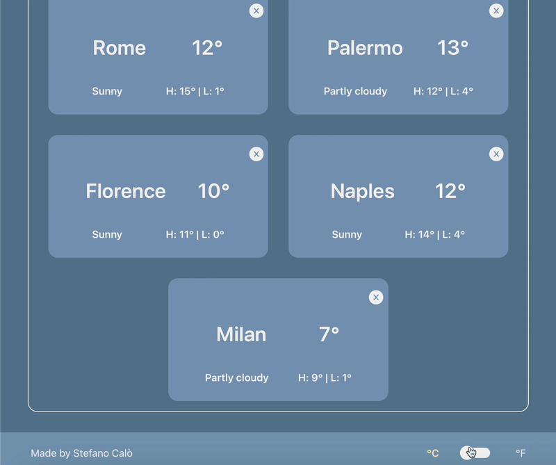

<a name="readme-top"></a>


<!-- PROJECT LOGO -->
<br />
<div align="center">
  <a href="https://github.com/Stefanocalo/weather-app">
    
  </a>

<h3 align="center">Weather App</h3>

  <p align="center">
    A 
    <br />
    <a href="https://github.com/Stefanocalo/weather-app"><strong>Explore the docs »</strong></a>
    <br />
    <br />
    <a href="https://city-forecast-app.netlify.app">View Demo</a>
    ·
    <a href="https://github.com/Stefanocalo/weather-app/issues">Report Bug</a>
    ·
    <a href="https://github.com/Stefanocalo/weather-app/issues">Request Feature</a>
  </p>
</div>


<!-- TABLE OF CONTENTS -->
<details>
  <summary>Table of Contents</summary>
  <ol>
    <li>
      <a href="#about-the-project">About The Project</a>
      <ul>
        <li><a href="#built-with">Built With</a></li>
      </ul>
    </li>
    <li>
      <a href="#getting-started">Getting Started</a>
      <ul>
        <li><a href="#prerequisites">Prerequisites</a></li>
        <li><a href="#installation">Installation</a></li>
      </ul>
    </li>
    <li><a href="#usage">Usage</a></li>
    <li><a href="#contributing">Contributing</a></li>
    <li><a href="#contact">Contact</a></li>
  </ol>
</details>


<!-- ABOUT THE PROJECT -->
## About The Project



A simple but effective weather app using third party api. 

Feel free to change units between Celsius and fahrenheit, add, remove bookmark and check the weather for the upcoming 2 days.

<p align="right">(<a href="#readme-top">back to top</a>)</p>


### Built With

<br>

* [![React][React.js]][React-url]

<br>

<p align="right">(<a href="#readme-top">back to top</a>)</p>


<!-- GETTING STARTED -->
## Getting Started

This is an example of how you may give instructions on setting up your project locally.
To get a local copy up and running follow these simple example steps.

### Prerequisites

This is an example of how to list things you need to use the software and how to install them.
* npm
  ```sh
  npm install npm@latest -g
  ```

### Installation

1. Get a free API Key at [https://openai.com](https://openai.com)
2. Clone the repo
   ```sh
   git clone https://github.com/github_username/repo_name.git
   ```
3. Install NPM packages
   ```sh
   npm install
   ```
4.Create a .env file in the root folder and enter API:
   ```js
   const API_KEY = 'ENTER YOUR API';
   ```

<p align="right">(<a href="#readme-top">back to top</a>)</p>

<!-- USAGE EXAMPLES -->
## Usage

As soon as the app load you'll be asked if you want to provide your location. Not to worry if you don't feel confortable with it. You can simply search your location and the autocomplete feature will do the rest.



Chek the next 24 hour forecast hour by hour...



...Or check the details for the next two days!


Remove or add bookmarks to have them ready the next time you'll need to check weather for a particular locaton.



Simply tap on a bookmark to check the weather for the location in a moment!



By default the app uses Celsius. Not to worry! Simply tap to the unit switch to instantly display the choosen unit without load times!



<br>

<p align="right">(<a href="#readme-top">back to top</a>)</p>

<!-- CONTRIBUTING -->
## Contributing

Contributions are what make the open source community such an amazing place to learn, inspire, and create. Any contributions you make are **greatly appreciated**.

If you have a suggestion that would make this better, please fork the repo and create a pull request. You can also simply open an issue with the tag "enhancement".
Don't forget to give the project a star! Thanks again!

1. Fork the Project
2. Create your Feature Branch (`git checkout -b feature/AmazingFeature`)
3. Commit your Changes (`git commit -m 'Add some AmazingFeature'`)
4. Push to the Branch (`git push origin feature/AmazingFeature`)
5. Open a Pull Request

<p align="right">(<a href="#readme-top">back to top</a>)</p>

<!-- CONTACT -->
## Contact

Stefano Calò - stefano.cal92@gmail.com

Project Link: [https://github.com/Stefanocalo/weather-app](https://github.com/Stefanocalo/weather-app)

<p align="right">(<a href="#readme-top">back to top</a>)</p>


<!-- MARKDOWN LINKS & IMAGES -->
<!-- https://www.markdownguide.org/basic-syntax/#reference-style-links -->

[React.js]: https://img.shields.io/badge/React-20232A?style=for-the-badge&logo=react&logoColor=61DAFB
[React-url]: https://reactjs.org/